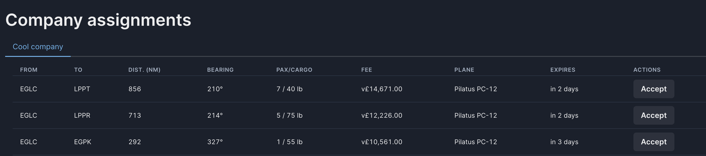
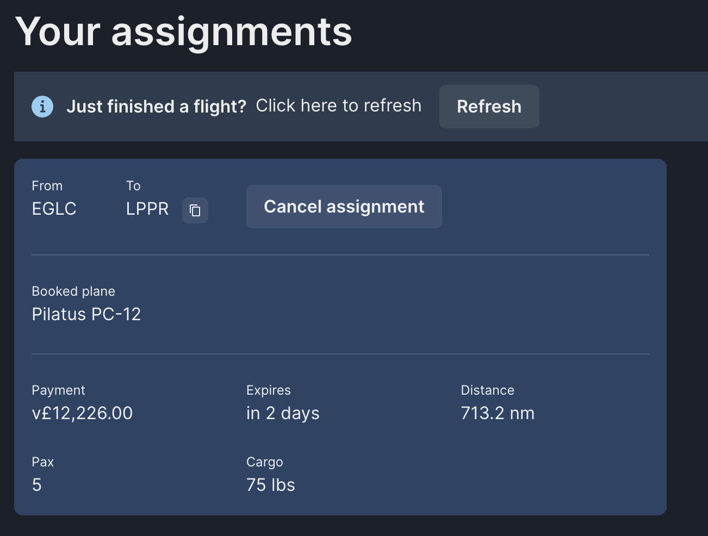

In order to do a flight you will need an assignment, and if that assignment doesn't have an associated plane, have a plane ready to flight. But if this is your first flight you probably won't have a plane of your own, so you'll need to find a company that offers flights with planes.

For that, visit the `Companies`, choose a company and see from where they flight. Their jobs will be listed under their name.

If the `Plane` column shows a plane, you will be able to accept the assignment.

## Pre-flight

Now visit `Pre-flight`, this page will show you information you need to complete your flight. If for whatever reason you decide you don't want to fly this assignment, cancel it from here.

### Expiration

Note that each assignment will have an expiration date! If you complete the assignment _after_ that time, the system will reject it because you will have done it too late.

## Complete the flight

Launch MSFS, then the Nebula client. Load the plane in the airport of origin, in the example above you will need to load the `Pilatus PC-12` at `EGLC`. Time of flight is up to you, and for this company flights the fuel is up to you too. The company pays!

Once you have loaded select `Start flight` on the client. You can do that at any point before taking off, personally I'd recommend to do it as soon as you load the plane so you don't forget!

The client will check the location and plane matches the assignment, and if everything is correct it will indicate that is recording.

Fly to your destination (in this case, `LPPR`), get off the runway and proceed to your designated parking space. Once you set your parking brakes, the client will allow you to `Complete your flight`. This will send your flight information to our servers, record the assignment as completed and send you the payment.

Congratulations, you have completed your first flight on Nebula!
