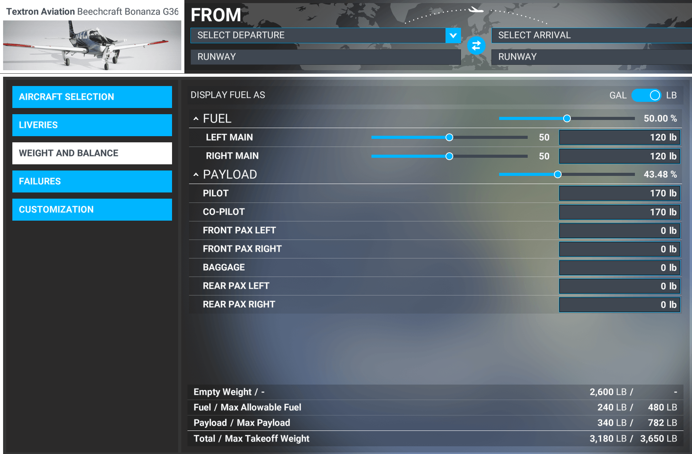

The current list of planes available in Nebula is limited to simplify testing. But if you rather use a different model please let us know!

## Information needed

If you want a new model to be added to Nebula, send us on Discord a screenshot of the **weight balance screen** from MSFS, showing all the values listed below.

We will also need the `atcModel`, you can find on the `aircraft.cfg` file, normally located on the following directory:

```
\<plane-name>\SimObjects\Airplanes\<plane-name>\aircraft.cfg
```

**All fuel, cargo and plane weight values in pounds (lbs)**


